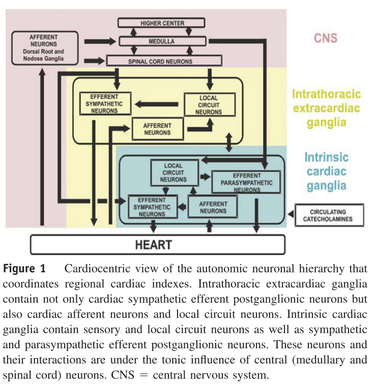
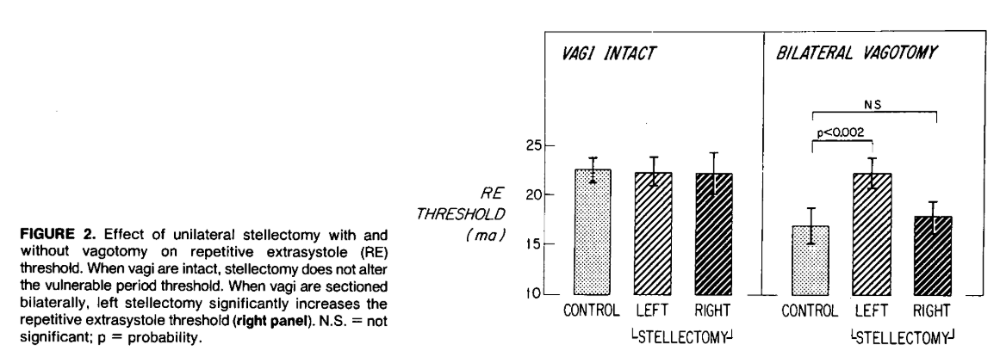
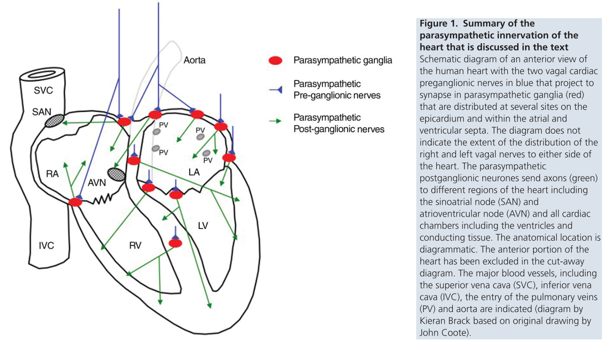
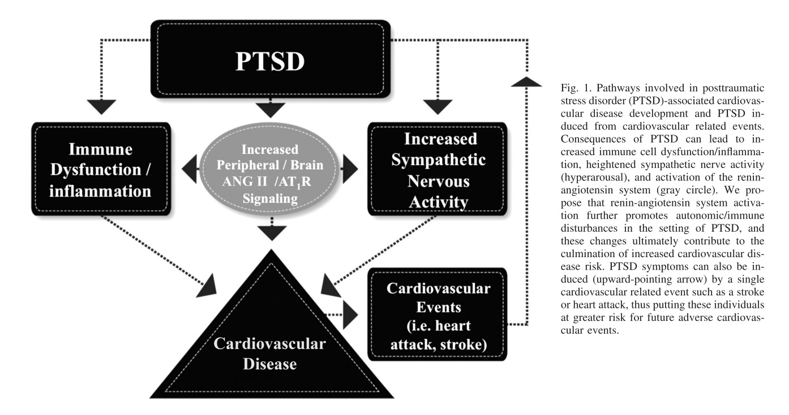

# Physiological basis of brain-heart interactions

## Neurocardiology
1. Historical studies of brain affecting the heart
	1. Increased nervous activity can lead to sudden death through ventricular fibrillation.[@Lown1977]
		1. Animal models show that brain stimulation can lead to ventricular fibrillation, including through chemical means.[@Levy1914] 
		1. In susceptible myocardium, such as after myocardial ischemia, central nervous stimulation can trigger ventricular fibrillation more readily.[@Kolman1975]
		1. Increased psychological stress reduces threshold for ventricular response, suggesting electrical instability in canine model.[@Lown1973]
1. Relevant cardiac anatomy
	1. Pathways between heart and brain are complex.[@Davis1993]
	1. Important anatomy includes: medullary (parasympathetic) and spinal cord (sympathetic efferent neurons, afferent inputs to CNS from arterial and cardiac wall mechanosensors.[@Williamson2006]
	1. **Potential Figure** showing complexity of cardiac anatomy 

	1. Highlighting difference between intrinsic cardiac ganglia, intrathoracic extracardiac ganglia, and CNS, such that there is limited/unknown sympathetic afferent neurons from heart to higher levels.[@Armour2010; @Coote2013]
	1. Combination of abnormal cardiac myocyte and cardiac nervous system effect overall cardiac function.[@Armour2008]
	1. Supramedullary effects are also present, such that the left and right insular stimulation creates different effects in bradycardia with the left, and tachycardia with the right.[@Oppenheimer1992]

## Autonomic nervous system affect on cardiovascular system
1. Sympathetic nervous system
	1. Stimulation of the stellate ganglion in canine models had increased chance of causing ventricular fibrillation particularly after coronary occlusion.[@Harris1971]
	1. Stellate ganglion thought to be carrying efferent sympathetic fibers. After stellate ganglionectomy, the VF threshold increased to 11% from 31% (compared to control VF rate).[@Kliks1975]
	1. Affect is complicated however, as unilateral stellectomy may have compensatory contralateral activation, and then are agonized by vagal activity.[@Schwartz1977a]

1. Parasympathetic nervous system
	1. Vagal influence was not thought to be salutary independently, it only provided protection to VF threshold with concurrent increased sympathetic tone.[@Kolman1975]
	1. Vagal nerve asks through muscarinic, nicotinic, and adrenergic signals, such as methachole could raise ventricular vulnerable threshold, which could reduced with atropine.[@Rabinowitz1976]
	1. Vagal activity is controversial, as sympathetic-independent nitrergic parasympathetic postganglionic nerves can independently provide ventricular protection and decrease SA-AV conduction.[@Ng2001; @Brack2007; @Brack2011; @Coote2013]

	1. Multiple types of cardiac vagal preganglionic neurons exist in the medulla in feline models, one affected by respiration and one that was not.[@Daly1989]

# Measurement of brain-heart interactions

## Invasive measurements
1. Electrical measurements
	1. Microneurography
		1. Multiunit postganglionic sympathetic nerve activity (MSNA) can be recorded from the peroneal nerve using microneurography. A tungsten microelectrode is inserted into the nerve, and signals are rectified and integrated over time to obtain a mean voltage of sympathetic nerve activity. This is usually expressed burst frequency.[@Park2017; @Mano2006; @Wallin1988]
1. Chemical measurements
	1. Baroreceptor reflex 
		1. Gold standard method is through the Modified Oxford technique. MSNA and RR interval are measured during arterial BP changes induced through nitroprusside and phenylephrine.[@Rudas1999]
	1. Catecholamines

## Heart rate variability measurements
1. Relevance of HRV
	1. Heart rate variability is the measurement of overall autonomic outflow after modulation. Historically, the largest prospective study, ATRAMI, showed reduced BRS and HRV led to worse outcomes after MI.[@LaRovere1998] The varied changes in RR intervals, measured through HRV through different methods, suggest that factors that influence HRV and thus the sinus node, are autonomic in etiology.[@Saul1990] 
	1. As the autonomic system has supramedullary inputs, HRV may index emotional landscape and psychosocial stress.[@Thayer2000] And as HRV associates with overall cardiovascular mortality, it may be related to the effect on autonomic imbalance on mortality.[@Thayer2010]
	1. Reflects cardiac autonomic regulation although the contributions of parasympathetic and sympathetic nervous systems are unknown.[@Billman2011a; @TaskForceoftheESCandNAS1996]
	1. Improvement in HRV occurs after cardiac rehabilitation, in line with improvement in functional status.[@Jelinek2013]
1. Measurement techniques	
	1. Geometric domain
		1. SDNN over 24 hour hours, when decreased after MI, had increased mortality.[@Kleiger1987]
	1. Frequency domain
		1. Power spectral analysis can be broken down into 4 categories, ULF, VLF, LF, HF, and correspond to different cardiac sympathovagal balance (HF = RSA/vagal, LF = SNS, VLF = RAAS).[@Akselrod1981]
		1. After MI, LF was higher and HF was lower than in controls. HF "vagal tone" is reduced after MI but normalizes over the following year.[@Lombardi1987]
		1. Unclear the role of each frequency band, as LF may not be an adequate measure of sympathetic activity.[@Houle1999] The LF/HF ratio may also not represent sympathovagal balance.[@Billman2013]
	1. Non-linear domain
		1. Non-linear HRV uses the relationship between RR(n) and RR(n+1) to analyze heart rate dynamics. The multipole/Poincaré method results in *Dyx*, which is shown to be a prognostic marker in patients s/p myocardial infarction.[@Jørgensen2015; @Jørgensen2016; @Olesen2005]
1. Considerations
	1. Heart rate and HRV are not independent, but the relationship can be adjusted for mathematically.[@Sacha2014]
	1. Gender plays a significant role in HRV, and men and women cannot be compared easily.[@Sacha2014a]

# Impact of stress-related disorders on autonomic function and cardiovascular disease

## Physiological influence of stress-related disorders
1. Relationship of psychological stress with cardiovascular events
	1. Early study looked at sudden death in factory workers - interview based data noted that a majority had been depressed prior to the event, and were acutely precipitated by arousal (anxiety, anger, increased work stress), suggesting that abrupt psychological changes leads to disharmonious responses.[@Greene1972]
	1. Finland study with life stress and CHD (MI n=279, SCD n=226), showed both populations had recent life stress in prior 6 months, but even more strongly in those with SCD.[@Rahe1973]
	1. Anecdotally stress and anger events precede MI. Interviewing n=1623 patients right after MI showed that anger occurred 2 hours prior had a RR=2.3, which was reduced in those taking aspirin but mechanism unknown.[@Mittleman1995]
1. Pathophysiological changes
	1. In normal hearts, in the setting of monkeys on high-cholesterol diet, psychosocial stress led to endothelial damage, which was limited by the administration of B1-blockers.[@Strawn1991]
	1. Type A behavior traits compared to type B behavior traits had significantly more coronary calcification.[@Sparagon2001]
	1. In mice model, chronic social stress leads to increased sympathetic tone (based on geometric HRV), decreased circadian rhythm, and myocardial fibrosis.[@Costoli2004] This compares with the concept of chronic psychosocial stress through human development, as the increased allostatic load leads to worse cardiovascular outcomes.[@Danese2012]
	1. Insular cortex may mediate the sympathetic tone that leads to myocardial injury, such as seen in Takotsubo cardiomyopathy.[@Nagai2017]

## Post-traumatic stress disorder
1. Clinical 
	1. PTSD can be diagnosed by SCID.[@First1996]
	1. Characterized by emotional/mental stress after trauma, sx include hyperarousal, flashbacks/nightmares, intrusive thoughts
	1. Health consequences are multi-organ, including cardiovascular risk even after adjustment for other factors.[@Boscarino1997; @Boscarino2008] 
1. Autonomic mechanism
	1. Angiotensin II  may mediate some of the sympathetic activity, and thus some of the increased CVD risk.[@Reid1992]

	1. PTSD leads to higher resting HR and BP, and was dependent on chronicity of PTSD.[@Buckley2001] Increased nocturnal SNS dominance has been seen, changing diurnal sleeping ANS function.[@Muraoka1998]
	1. Baroreflexes are also reduced in patients with PTSD, included blunted changes in HR and greater orthostasis.[@Peckerman2003; @Hughes2007] 
	1. Reduced/blunted BRS and increased MSNA occur during mental stress in PTSD than controls.[@Park2017]
	1. PTSD had inversely related with VLF and LF, even after adjustment for other risk factors.[@Shah2013]
1. Cardiovascular risk
	1. Double the CHD in veteran twin pairs discordant for PTSD.[@Vaccarino2013] Increased CAC scores independent of risk factors in PTSD veterans.[@Ahmadi2011] PTSD particularly in women have a significantly higher incidence of CHD.[@Vaccarino2017]

## Depressive disorders
1. Clinical
	1. Depression is prevalent in the US, affecting roughly 1/6 adults.[@Kessler2005] It also is associated with cardiovascular events.[@Carney2017]
	1. Can be measured in severity through Beck Depression Inventory.[@Beck1988]
	1. Relationship may be bidirectional, as mental disorders including depressive episodes and dysthymia can develop after CAD.[@Schaich2018]
1. Autonomic mechanism
	1. Depression coexsits with coronary heart disease, increases poor prognosis. Physiologically represents chronic, severe stress.[@Carney2017]
	1. When depression is studied by HRV, the relationship appears bidirectional, but more heavily that autonomic dysfunction affects depression risk more than the converse.[@Huang2018]
	1. After ACS, HRV is decreased over 24-hour ECG monitoring in patients with depression than those without.[@Carney2001b]
	1. Depression is related to decreased HRV in both clinical and non-clinical populations.[@Paniccia2017] Thought to be partially due to prefrontal cortex hypoactivity, which possibly contributes to vagal withdrawal.[@Sgoifo2015]
	1. Decreases in HF HRV in depression is associated with suicidal ideation, even after adjustment of depression, anxiety, and stress.[@Adolph2018]
	1. Mechanism of lower HRV and depression is partially influenced by underlying biological pathway
1. Cardiovascular risk
	1. Increased cardiovascular risk occurs independently with onset of depression for decades after diagnosis.[@Ford1998]
	1. First ever depressive episode after ACS led to a OR of 2.6 for recurrent cardiac event.[@Ossola2018]

## Anxiety disorder
1. Clinical
1. Autonomic mechanism
	1. Anxiety is related to decreased HRV in both clinical and non-clinical populations.[@Paniccia2017]
	1. In anxious depression, higher pretreatment HRV had better outcomes, while in non-anxious depression lower pretreatment HRV had better outcomes. 
	1. Reduced HRV seen in all major psychiatric disorders.[@Alvares2016]
1. Cardiovascular risk
	1. Anxiety may have an opposing effect to depression after ACS, being weakly protective in those who did not develop incidental depression.[@Ossola2018]

# Cardiovascular risk

## Mental stress
1. Vasomotor response
	1. In patients with CAD, increased vasomotor tone during mental-stress associates with increased activation in the insula and parietal cortex.[@Shah2018]
	1. Women have higher peripheral arterial tone during mental stress, but lower reactive hyperemia index after mental stress which suggests microvascular dysfunction, with doubled the rate of MSIMI than in men..[Vaccarino2018] 
1. Brain correlates
	1. Stress-induced vasoreactivity leads to changes in brain responses during mental stress in patients with CAD.[@Shah2018]
	1. MSIMI associated with activation in brain areas involving autonomic regulation (left insula activation, and right precentral, postcentral, and temporal gyrus).[@Bremner2018]

## Gender differences
1. Differences in myocardial ischemia
	1. Unclear etiology of differences in ischemia, with older studies finding anginal stories and ischemic changes, but without consistent catherization data for plaque.[@Glancy1971]
	1. Depressive disorders after CAD are predicted by female gender and younger age.[@Schaich2018]
	1. Women have higher peripheral arterial tone during mental stress, but lower reactive hyperemia index after mental stress which suggests microvascular dysfunction, with doubled the rate of MSIMI than in men..[Vaccarino2018] 
	1. For those with suspected or established CAD, depression increases the risk of death, particularly in women.[@Shah2014]
1. Stress-related mental disorders
	1. Increased risk of PTSD and depression in women than in men, which may lead to more vulnerability to cardiovascular disease than in men.[@Vaccarino2017]
	1. Women and men have differences in cardiovascular responses to MSIMI, such that women have more peripheral vasoconstriction, while men have increased hemodynamic workload.[@Sullivan2018a]
	1. Women with CAD are also more susceptible to MSIMI.[@Vaccarino2016a]

## Treatment and behavioral modification 
1. Biofeedback
	1. HRV biofeedback is a self-regulation of a "dysregulated" vagal nerve, thought to help with management of mental-health disease.[@Blase2010] 
	1. Mindfulness training reduces subjective feelings of depression after ACS.[@Lundgren2018]
	1. Meditation also increases HRV and has brain correlates with changes in the anterior cingulate gyrus and hippocampus.[@Tang2009]
1. Medications
	1. Antidepressants
		1. T wave amplitude and QTc length did not change in patients with depression or anxiety on TCA, SSRI, SNRI. 
		1. Initial studies with SSRI showed it is safe in MI, but also showed trend of better overall functioning.[@Glassman2002]
		1. After ACS, SSRI shows decreased MACE in long-term followup (median 8 years).[@Kim2018]
		1. TCA however show a further decrease in HRV in patients with anxiety or mood disorders, while the data on SSRI and SNRI is much more mixed.[@Alvares2016] SSRI seem to increase HRV in patients with depression.[@Kidwell2018]
1. Other
	1. Vagal nerve stimulation reduces depression symptoms, but unknown effects on cardiovascular risk.[@Kidwell2018]

# References
